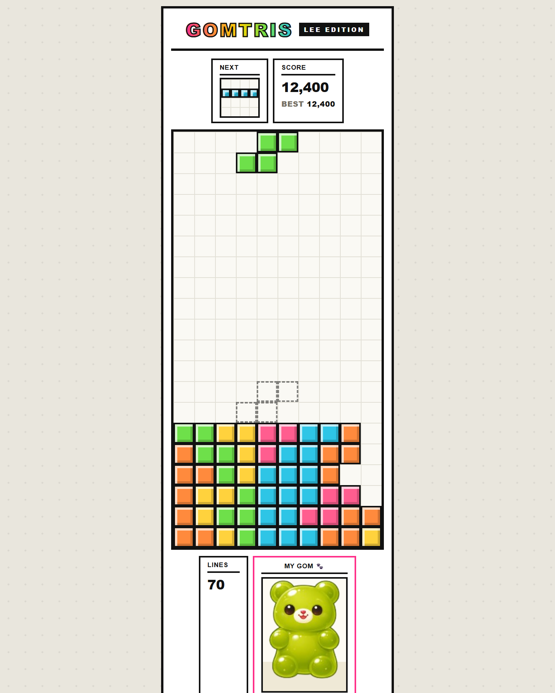

# 🐻 Gomtris — LEE Edition

곰돌이가 자라는 Y2K 감성 블록 퍼즐 게임.

<p align="center">
  
</p>

## 기술 스택

- **HTML5 + CSS3** (Y2K 포스터 테마, 반응형)
- **Vanilla JavaScript** — 프레임워크·빌드 도구 없음
- **WebAudio API** — 효과음 실시간 합성
- **PWA** — Service Worker + Web App Manifest

## 최종 산출물

- 🌐 **배포(PWA)**: https://gorgeous-truffle-914e1c.netlify.app/
- 📲 **설치형 앱**: 위 주소 접속 → "홈 화면에 추가"(iOS) / "앱 설치"(Android) → 전체화면·오프라인 실행

## 게임 설명

- 떨어지는 블록을 회전·이동해 가로 줄을 채우면 사라지고 점수를 얻는 클래식 블록 퍼즐
- 줄을 지울수록 화면의 **젤리곰이 1~11단계로 성장** (크기 ↑, 색 변화, 후반엔 돌아다님)
- 키보드(PC) / 손가락 터치(폰) 모두 지원

## 기능 (핵심·기술 포인트)

- **7-Bag 랜덤** + **월 킥**(회전 보정) + **고스트 블록**(착지 위치 미리보기)
- **젤리곰 성장 시스템**
  - 크기 = 곰 단계(`줄÷10+1`, 1~11)
  - 색 = **2단계(10줄) 진입 순간** 줄 지운 블록 색으로 **고정**(이후 유지)
  - **9단계부터만** 화면을 돌아다님(그 전엔 고정)
- **WebAudio 합성 효과음** — 음원 파일 없이 코드로 생성 / **BGM** 레벨업 시 템포 상승
- **PWA 오프라인 캐시** — Service Worker로 앱 셸 캐싱
- **폰 터치 제스처** — 드래그(이동)·탭(회전)·플릭(하드드롭)
- **반응형** — 모바일에서 보드를 화면 높이에 맞춰 자동 축소

## 디렉토리 구조

```
07.gomtris/
├── index.html              # 진입점
├── manifest.json           # PWA 매니페스트
├── sw.js                   # 서비스워커(오프라인 캐시)
├── icon-192.png / icon-512.png   # 앱 아이콘
├── assets/
│   ├── audio/bgm.mp3       # (선택) 배경음
│   └── gomimg/             # 곰 이미지 (색깔별 png)
└── src/
    ├── css/style.css       # 테마 + 곰/블록 스타일
    └── js/
        ├── config.js       # 상수(보드/점수/속도/블록→곰색)
        ├── audio.js        # 효과음(합성) + BGM
        ├── tetrominoes.js  # 블록 정의 + 7-Bag
        ├── board.js        # 게임판 상태/충돌/줄제거
        ├── renderer.js     # DOM 격자 렌더링
        ├── jellybear.js    # 젤리곰 성장/이동
        ├── game.js         # 게임 루프/규칙
        ├── input.js        # 키보드 입력
        ├── touch.js        # 터치 제스처
        └── main.js         # 부트스트랩
```
